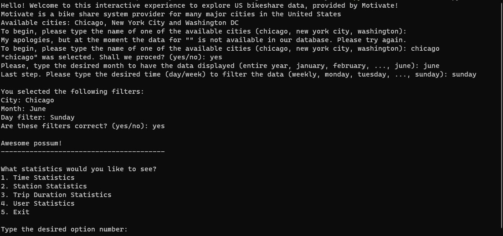

### Date created
This project was created on 25-04-2023 and post on github on 28-05-2023

# Project Title
Bikeshare Project

### Description
This project main goal was to test the student capabilities of using python to create a portifolio, learn how to use version control and to post their work on github.
The bikeshare.py file is an interactive data science portifolio tool that allows the user to calculate various statistical data from users of a bike share system provider called Motivate.

The available cities are:

- New York City
- Chicago
- Washington DC
  
Available raw data includes:

- Start time
- End time
- Trip duration
- Start station
- End station
- User type
- Gender (NYC and chicago only)
- Birth year (NYC and chicago only)

**Run it:** Open your terminal, navigate to the file folder and type python bikeshare.py

**System requirements**

Python 3 and also the libraries pandas, numpy and time installed.

### Files used
The data is stored in .csv files. To work this project folder should contain:

* bikeshare.py
* chicago.csv
* new_york_city.csv
* washington.csv

### Credits

I'd like to thank chatGTP for the help in this project.

